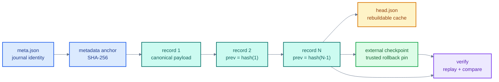

# Chaintrail

Chaintrail is a small Go tool for tamper-evident, append-only local audit journals. It is intended for scripts, deployment tooling, maintenance jobs, and internal utilities that need a durable record of *what happened* without standing up a database or logging service.

Each record is hash-chained to the previous record and to immutable journal metadata. `verify` replays the chain, validates sequence numbers and canonical payloads, and reports the current head hash. A checkpoint can be stored outside the journal to detect rollback or wholesale replacement.

## Architecture


The append path is deliberately short: validate input, acquire the OS lock, rebuild a stale head cache when needed, canonicalize the JSON payload, derive the next record hash, append one NDJSON line, `fsync`, and atomically refresh `head.json`. Verification does not trust the cache; it replays the journal from the metadata-derived anchor.

### Integrity flow



## Install

```bash
go install github.com/PSR94/chaintrail/cmd/chaintrail@latest
```

Or build locally:

```bash
go build -o chaintrail ./cmd/chaintrail
```

Append/repair locking currently targets Unix-like systems (Linux and macOS).

## Quick start

```bash
chaintrail init
chaintrail append -kind deploy.started -data '{"service":"api","version":"1.4.2"}'
chaintrail append -kind deploy.completed -data '{"service":"api","duration_ms":8421}'
chaintrail verify
chaintrail tail -n 2
```

By default the journal lives in `.chaintrail/`:

```text
.chaintrail/
├── meta.json
├── journal.ndjson
├── head.json
└── journal.lock
```

`head.json` is only a performance cache. If it is missing or stale, Chaintrail rebuilds it from the journal before the next append.

## Checkpoints

A valid local hash chain cannot prove that an attacker did not replace the entire journal with an older, internally valid copy. Pin a checkpoint somewhere outside the journal when rollback detection matters:

```bash
chaintrail checkpoint
# 4b7c...:42:8f1d...

chaintrail verify -checkpoint '4b7c...:42:8f1d...'
```

For a current-head pin when you only care about the final digest:

```bash
chaintrail verify -expect 8f1d...
```

## Payload input

Exactly one payload source is required:

```bash
chaintrail append -kind job.started -data '{"job":"backup"}'
chaintrail append -kind job.started -file event.json
cat event.json | chaintrail append -kind job.started -stdin
```

Payloads are limited to 1 MiB and normalized to canonical JSON before hashing. Record kinds are limited to 64 characters using letters, digits, `.`, `_`, `:`, and `-`.

## Crash and corruption behavior

Appending is serialized with an OS file lock. Chaintrail writes the complete NDJSON record, calls `fsync`, then atomically updates the head cache. If a process dies after the record is durable but before the cache update, the cache is rebuilt automatically from the log size mismatch.

A crash can still leave a partial final record on filesystems or environments that violate normal append guarantees. `verify` treats that as corruption. `repair` is intentionally narrow: it truncates only an incomplete final line, then verifies every earlier record before accepting the repair.

```bash
chaintrail repair
```

Chaintrail will not rewrite, skip, or “fix” a fully formed record with a bad hash. That requires investigation rather than automated recovery.

## Integrity model

For record `N`:

```text
hash(N) = SHA256("chaintrail-record-v1\n" + canonical_json(record_without_hash))
prev(N) = hash(N-1)
```

The first record's `prev` value is a SHA-256 anchor over `meta.json`, binding the journal ID and creation time into the chain.

This provides evidence of record modification, insertion, deletion, reordering, and truncation when a trusted checkpoint is available. It does **not** provide confidentiality, identity/authorship, remote replication, or cryptographic signatures.

## Exit codes

- `0`: success
- `1`: I/O or operational failure
- `2`: invalid CLI usage
- `3`: integrity verification failure

## Development

```bash
gofmt -w .
go vet ./...
go test -race ./...
go build ./cmd/chaintrail
```

The tests cover canonical hashing, tamper detection, stale-cache recovery, concurrent append serialization, trailing-partial repair, refusal to repair earlier corruption, checkpoint parsing, validated tail reads, and CLI smoke behavior.
