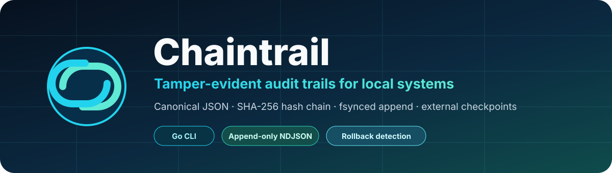
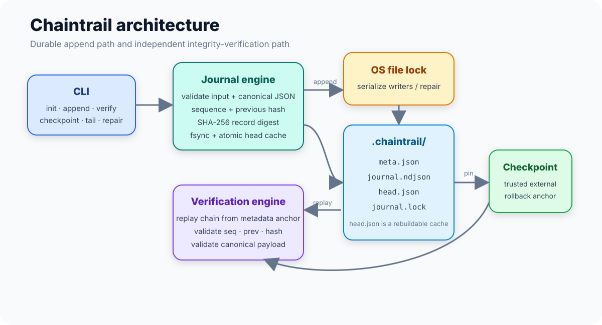
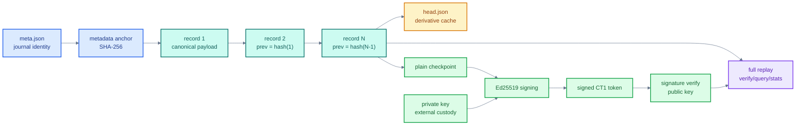

# Chaintrail

[](https://github.com/PSR94/chaintrail/actions/workflows/ci.yml)


Chaintrail is a production-minded local audit journal for deployment tooling, maintenance jobs, backup scripts, internal automation, and other systems that need a durable record of what happened without operating a database or remote logging service.

The journal is append-only NDJSON. Every record is bound to the previous record with a SHA-256 hash chain and the first record is bound to immutable journal metadata. Verification replays the complete chain. External checkpoints can be pinned outside the journal, and checkpoints can be authenticated with Ed25519 signatures so operators can distinguish a trusted anchor from an arbitrary copied hash.

Chaintrail intentionally stays local and dependency-free at runtime. The project focuses on integrity, deterministic encoding, crash behavior, concurrency, explicit failure semantics, and inspectable operations rather than becoming a general log aggregation platform.

## Why this exists

Many operational scripts eventually grow requirements that plain text logs do not satisfy:

- a deployment pipeline needs evidence that earlier events were not edited after the fact;
- a backup job needs a small durable history even when the monitoring stack is unavailable;
- a maintenance tool needs structured JSON records that can be queried without trusting an index;
- an incident review needs a known-good checkpoint stored somewhere other than the machine being investigated;
- a local agent needs predictable crash behavior and no external infrastructure dependency.

Chaintrail addresses that narrow problem. It is not a substitute for centralized observability, SIEM, database auditing, signatures on every event, or secret storage.

## Capabilities

| Area | Behavior |
| --- | --- |
| Append | Canonicalizes payload JSON, serializes writers with an OS file lock, appends one NDJSON record, `fsync`s the journal, then atomically refreshes the head cache. |
| Integrity | SHA-256 chain binds sequence, timestamp, kind, canonical payload, and previous hash. |
| Verification | Replays the complete journal from the metadata-derived anchor; does not trust `head.json`. |
| Plain checkpoints | Pins `journal_id:sequence:hash` outside the journal for rollback/truncation detection. |
| Signed checkpoints | Ed25519-authenticated `CT1...` tokens with key identity and signing time. |
| Query | Filters by exact kind, kind prefix, sequence range, or time range while still validating the complete chain. |
| Statistics | Computes journal size, payload size, record counts, kind distribution, time range, and verified head only after a full scan succeeds. |
| Recovery | Repairs only an incomplete final record; refuses to rewrite or skip earlier corruption. |
| Concurrency | Shared locks for readers/verification, exclusive locks for writers and repair on supported Unix-like systems. |
| CI/release | Formatting, vetting, shuffled tests, race detector, coverage, benchmark smoke, Go-version compatibility, cross-platform release archives, and checksums. |

## Architecture



The repository has three operational paths:

1. **Write path** — validate input, serialize the writer, resolve a trustworthy head, canonicalize payload JSON, derive the new digest, append and sync the record, then refresh the derivative head cache.
2. **Read/analysis path** — `verify`, `query`, `stats`, and `tail` replay the chain from the metadata anchor before returning trusted results.
3. **Trust-anchor path** — export a plain checkpoint or sign the current verified checkpoint with an Ed25519 private key kept outside the journal host.

### Integrity and trust flow



See [Architecture](docs/ARCHITECTURE.md) for invariants, crash-consistency rules, lock behavior, head-cache semantics, and trust boundaries.

## Quick start

Build the CLI:

```bash
go build -o chaintrail ./cmd/chaintrail
```

Initialize a journal:

```bash
./chaintrail init -dir .audit
```

Append structured events:

```bash
./chaintrail append -dir .audit \
  -kind deploy.started \
  -data '{"service":"api","version":"1.4.2","actor":"release-bot"}'

./chaintrail append -dir .audit \
  -kind deploy.completed \
  -data '{"service":"api","version":"1.4.2","duration_ms":8421}'
```

Verify the entire chain:

```bash
./chaintrail verify -dir .audit
```

Inspect trusted data:

```bash
./chaintrail query -dir .audit -kind-prefix deploy. -format json
./chaintrail stats -dir .audit
./chaintrail tail -dir .audit -n 5
```

## Signed checkpoint workflow

A plain hash chain detects modification inside the journal, but a machine-local journal cannot prove that an attacker did not replace the entire directory with an older internally valid copy. The checkpoint workflow moves a trust anchor outside that directory.

Generate an Ed25519 key pair once, preferably on a different protected machine or secret-management boundary:

```bash
./chaintrail keygen \
  -private keys/chaintrail-checkpoint.key.pem \
  -public keys/chaintrail-checkpoint.pub.pem
```

The command refuses to overwrite an existing key. The private key file is created with mode `0600`; the public key uses `0644`.

Sign the current verified head:

```bash
TOKEN="$(
  ./chaintrail checkpoint \
    -dir .audit \
    -sign-key keys/chaintrail-checkpoint.key.pem
)"
```

Store that token somewhere outside `.audit/` — for example a deployment record, protected artifact store, change ticket, release metadata, or a separate host.

Later, verify both the signature and the journal prefix represented by the signed checkpoint:

```bash
./chaintrail verify \
  -dir .audit \
  -signed-checkpoint "$TOKEN" \
  -public-key keys/chaintrail-checkpoint.pub.pem
```

The journal may have grown since the checkpoint was signed. Verification succeeds when the signed sequence/hash is still present in the chain and the rest of the journal remains valid.

For environments that already have a trusted storage channel and do not need signature authentication, plain checkpoints remain available:

```bash
CHECKPOINT="$(./chaintrail checkpoint -dir .audit)"
./chaintrail verify -dir .audit -checkpoint "$CHECKPOINT"
```

## Validated queries

`query` is deliberately not an index lookup. It validates the entire chain and then returns matching records. Even when `-limit` has already been satisfied, scanning continues so corruption later in the file cannot be hidden by an early match.

Examples:

```bash
# Exact event kind
./chaintrail query -dir .audit -kind deploy.completed

# Event family
./chaintrail query -dir .audit -kind-prefix deploy.

# Inclusive sequence window
./chaintrail query -dir .audit -from 100 -to 150

# Inclusive time window
./chaintrail query -dir .audit \
  -since 2026-09-08T12:00:00Z \
  -until 2026-09-08T18:00:00Z

# One JSON document including verified head metadata
./chaintrail query -dir .audit -kind-prefix deploy. -format json
```

Default output is NDJSON so records can be streamed into standard Unix tooling. JSON output wraps records with `journal_id`, `head_seq`, and `head_hash` to identify the exact verified state used for the query.

## Verified operational statistics

`stats` performs a full integrity replay and only emits metrics if the journal is valid:

```bash
./chaintrail stats -dir .audit
```

Example fields:

```text
journal=<journal-id>
head_seq=248
head_hash=<sha256>
journal_bytes=118942
payload_bytes=29744
distinct_kinds=7
first_record_time=2026-09-01T09:14:51.238Z
last_record_time=2026-09-08T17:42:03.981Z
kind[deploy.completed]=42
kind[deploy.started]=42
```

Use `-format json` for automation.

## On-disk layout

A journal directory contains four operational files:

```text
.audit/
├── meta.json
├── journal.ndjson
├── head.json
└── journal.lock
```

- `meta.json` contains the format version, a random 128-bit journal ID, and creation time.
- `journal.ndjson` is the authoritative append-only record stream.
- `head.json` is a derivative performance cache containing the expected sequence, head digest, and observed journal size.
- `journal.lock` coordinates supported readers/writers; it contains no application state.

`head.json` can be deleted. The next append rebuilds it from the journal when the cache is stale or unusable. It is not a security boundary and is never used by full-chain verification as proof of integrity.

See [Format](docs/FORMAT.md) for field definitions and hash-domain details.

## Record model

A record is JSON with six fields:

```json
{
  "seq": 42,
  "time": "2026-09-08T17:42:03.981Z",
  "kind": "deploy.completed",
  "payload": {"service":"api","version":"1.4.2"},
  "prev": "<previous SHA-256 hex>",
  "hash": "<record SHA-256 hex>"
}
```

The digest is derived from the record without `hash`:

```text
hash(N) = SHA256(
  "chaintrail-record-v1\n" +
  canonical_json(record_without_hash)
)
```

The first record uses an anchor derived from immutable metadata:

```text
anchor = SHA256(
  "chaintrail-anchor-v1\n" +
  canonical_json(meta.json)
)
```

Payload JSON is limited to 1 MiB and canonicalized before storage. Record kinds are limited to 64 characters and may contain letters, digits, `.`, `_`, `:`, and `-`.

## Durability and concurrency

On supported Unix-like systems, append and repair acquire an exclusive OS file lock. Verification/query/stats/tail acquire a shared lock.

Append order is intentional:

1. validate and canonicalize input;
2. acquire the writer lock;
3. resolve the current head;
4. construct and hash the next record;
5. append the complete NDJSON line;
6. `fsync` the journal;
7. atomically replace `head.json` through a synced temporary file;
8. sync the journal directory.

If the process dies after the record is durable but before the head-cache replacement, the journal remains authoritative and the cache is rebuilt later.

The normal append fast path validates the cached head against journal size and the final record rather than replaying the full history on every write. Full-chain validation is performed by `verify`, `query`, `stats`, and `tail`. Operators who require a verification boundary before a high-trust operation should explicitly run `verify` and retain a checkpoint. This trade-off is discussed in [Security](docs/SECURITY.md).

## Recovery behavior

`repair` is intentionally narrow:

```bash
./chaintrail repair -dir .audit
```

It can remove an incomplete final record produced by an interrupted append. Before truncating, it verifies the complete intact prefix. It refuses to repair:

- a fully formed record with a bad digest;
- a sequence gap;
- a previous-hash mismatch;
- malformed or non-canonical payload data in an earlier record;
- any earlier corruption followed by a partial tail.

This behavior avoids turning an integrity incident into silent data loss. See the [operations runbook](docs/OPERATIONS.md) for the recovery and incident-response sequence.

## CLI reference

```text
chaintrail init [-dir DIR]
chaintrail append [-dir DIR] -kind KIND (-data JSON | -file PATH | -stdin)
chaintrail verify [-dir DIR] [-expect HASH] [-checkpoint TOKEN]
                  [-signed-checkpoint TOKEN -public-key PATH]
chaintrail checkpoint [-dir DIR] [-sign-key PRIVATE_KEY]
chaintrail query [-dir DIR] [-kind KIND | -kind-prefix PREFIX]
                 [-from SEQ] [-to SEQ] [-since TIME] [-until TIME]
                 [-limit N] [-format ndjson|json]
chaintrail stats [-dir DIR] [-format text|json]
chaintrail keygen [-private PATH] [-public PATH]
chaintrail tail [-dir DIR] [-n COUNT]
chaintrail repair [-dir DIR]
```

### Exit codes

| Code | Meaning |
| ---: | --- |
| `0` | Command completed successfully. |
| `1` | Operational/I/O/key error. |
| `2` | Invalid CLI usage. |
| `3` | Journal integrity verification failure. |

Signed-token authentication errors are operational failures (`1`) because the journal has not yet been accepted as corrupted; a successfully authenticated checkpoint that conflicts with journal history becomes an integrity failure (`3`).

## Security model

Chaintrail provides **tamper evidence**, not tamper prevention.

It is designed to detect record modification, insertion, deletion, reordering, malformed records, non-canonical payload replacement, and truncation relative to a trusted checkpoint. Signed checkpoints additionally authenticate who possessed the configured private key at checkpoint creation time.

It does not provide:

- payload confidentiality or encryption;
- per-event user identity or non-repudiation;
- protection when both the journal and every external checkpoint/private key are compromised;
- remote replication or availability guarantees;
- kernel/filesystem integrity;
- a defense against an attacker who can observe and alter the process before data reaches Chaintrail.

Read [Security and threat model](docs/SECURITY.md) before using Chaintrail as an audit control.

## Operational guidance

For a production-like deployment:

- place the journal on a filesystem with ordinary `fsync` and rename durability semantics;
- run the process under a dedicated OS identity where practical;
- restrict journal directory permissions;
- keep signing private keys outside the journal directory and ideally outside the journal host;
- emit signed checkpoints at meaningful control points such as releases, backup completion, or daily close;
- copy checkpoints to an independent trust domain;
- run full verification before relying on query/statistics output;
- back up the entire journal directory without rewriting NDJSON records;
- investigate integrity failures before attempting any repair.

See [Operations](docs/OPERATIONS.md) for backup, checkpoint custody, monitoring, incident handling, and recovery procedures.

## Repository structure

```text
.
├── cmd/chaintrail/              # CLI adapter and command-level tests
├── docs/
│   ├── ARCHITECTURE.md          # components, invariants, concurrency, crash behavior
│   ├── FORMAT.md                # on-disk and signed-token formats
│   ├── OPERATIONS.md            # deployment and incident runbook
│   ├── SECURITY.md              # threat model and trust boundaries
│   ├── TESTING.md               # test strategy and CI expectations
│   ├── adr/                     # architecture decision records
│   └── assets/                  # banner and architecture diagrams
├── examples/deploy-audit/       # end-to-end shell integration example
├── canonical.go                 # deterministic JSON encoding for record hashes
├── checkpoint.go                # plain checkpoint model
├── signing.go                   # Ed25519 key and signed-checkpoint support
├── journal.go                   # initialization, append path, record validation
├── verify.go                    # replay, tail, conservative repair
├── query.go                     # integrity-preserving record filters
├── stats.go                     # verified operational metrics
├── *_test.go                    # unit/integration/concurrency/security tests
├── Makefile                     # repeatable developer quality gates
└── .github/workflows/           # CI and tagged-release automation
```

## Development

Run the complete local quality gate:

```bash
make check
```

Individual targets:

```bash
make fmt-check
make vet
make test
make race
make cover
make bench
make build
```

The test suite covers canonical JSON behavior, tamper detection, stale-cache recovery, concurrent writers, partial-tail recovery, repair refusal, historical checkpoints, signed checkpoint authentication, wrong-key rejection, key overwrite protection, validated filtering, stats integrity, and CLI workflows.

Benchmarks are included for canonicalization and verification of a 1,000-record journal. They are performance observability tools rather than hard pass/fail thresholds.

See [Testing](docs/TESTING.md) and [Contributing](CONTRIBUTING.md) before changing integrity-sensitive code.

## Releases

Tags matching `v*` trigger the release workflow. The workflow reruns the project quality gate, cross-compiles Linux and macOS archives for `amd64` and `arm64`, generates SHA-256 checksums, and publishes the artifacts to the GitHub release associated with the tag.

Windows is intentionally excluded from release artifacts because append/repair locking is not implemented there. The package may compile on Windows, but commands requiring journal locking return an explicit unsupported-platform error rather than silently operating without serialization.

Release history is tracked in [CHANGELOG.md](CHANGELOG.md).

## Design decisions

Important architectural choices are recorded rather than left implicit:

- [ADR 0001 — Append-only NDJSON with chained digests](docs/adr/0001-append-only-ndjson.md)
- [ADR 0002 — Treat the head cache as derivative state](docs/adr/0002-head-cache-is-derivative.md)
- [ADR 0003 — Ed25519-signed external checkpoints](docs/adr/0003-signed-checkpoints.md)

## Non-goals

Chaintrail deliberately does not add a web server, database, daemon, distributed consensus layer, remote transport, or plugin system. Those features would change the failure model and deployment cost. The project is intended to remain a small auditable integrity primitive that other systems can invoke or embed.

## License

MIT. See [LICENSE](LICENSE).
